## Temas de la Seccion

Primeros pasos con el Vue CLI
En el cual Vue apoya con una serie de pasos para la creación de una aplicacion.

Trabajaremos con el paso de informació a traves de proprties

Revisaremos en el uso Vue DevTools en Chrome, las cuales nos da el control absoluto de la aplicacion y nos permite hacer una serie de pruebas y modificaciones.

### Temas Puntuales
1. Estructura de directorios.
2. Atajos en Vue
3. Props
4. Methods
5. Propiedades computadas
6. Componentes
7. Validaciones
8. y Mas

### Primera aplicacion con Vue CLI

Desde la terminal verificamos la version de vue
~~~
vue --version
~~~
Crearemos la primera aplicacion con vue, para ello, en la terminal y dentro de la carpeta del proyecto utilizaremos el comnado.

*vue create nombreDelPRoyectoSinEspacios*

En nuestro caso.
~~~
vue cretae 03-fundamentos
~~~
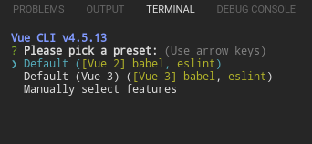

Pregunta que version queremos utilizar. En nuestro casa selecionaremos la opcion manual.
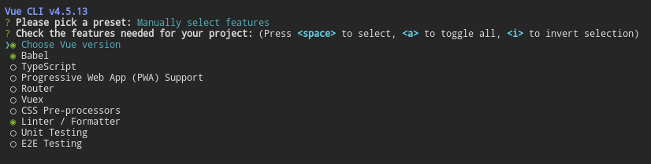

Babel, no permite mantener el codigo Javascript compatible, por ello o vamos a selecionar.
Linter es una potente herramienta para la validacion del de codigo, pero en este momento no lo utlizaremos ya que puede generarnos algunos inconvenientes.

Es importante señalar que si inicialmente no se selecciona algo como por ejemplo Router, no es problema incorporarlo posteriormente.

Para efectos del ejemplo selecionaremos:
Choose Vue Version
Bable
Unit Testing

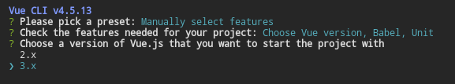
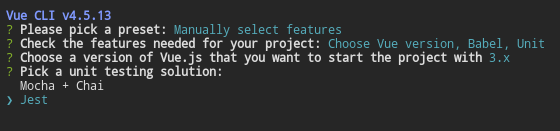
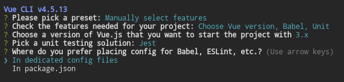
Por último, nos preguntará si deseamos generar un preset, respondemos que NO en esta oportundad por que nos faltan varias cosas como Router, etc

y se ejecuta la instalacion.

Nota importante: es recomendable que en un proyecto solo utilizar npm o yarn

Al finalizar la instalación nos muestra lo siguiente:
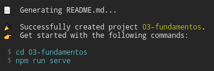

Notemos que se ha creado el directorio de nuestra aplicación con todas sus dependencias, en estes caso *03-fundamentos*. 

Y no propone dos comandos a ejecutar, el cd para ir a la carpeta y npm run serve. Al ejecutar este último, despliega el servidor de desarrollo

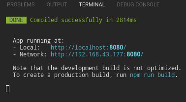

Donde podremos ver en nuestro navegador la aplicacion desplegada.

### Estructura de Directorios Generada por defecto

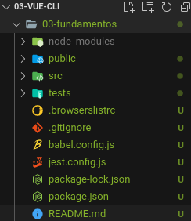

la carpeta de **node_modules** es de solo lectura y tiene los archivos y directorios ya que son solo para que funcionen algunas cosas y no serán parte parte de  del bundel o paquete final.

**public** es el directorio publico y sirve de "cascaron" dónde se montará la aplicacion final.
En el archivo index html se encunetra la directiva 
~~~
<noscript>
      <strong>We're sorry but <%= htmlWebpackPlugin.options.title %> doesn't work properly without JavaScript enabled. Please enable it to continue.</strong>
</noscript>
~~~
Que le avisa al usuario que debe tener activado javascript, ya que si no lo tiene activado la aplicacion no va a funcionar.
La aplicacion se monatar en la siguiente directiva
~~~

~~~
**test/**, sirve para agrupar las pruebas

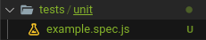

Los archivos con la extension .spec.js, son archivos dedicados para hacer evaluaciones sobre componentes o piezas de la aplicacion.
No necesariamente son compnentos o funciones de VUE, sino que tambien pueden ser nuestros compenetes, clases o funciones.

**.browserslistrc**, son archivos de configuracion, que en general no lo utilizaremos.

**babel.config** archivo de configuracion de Babel.

**jest.config** archivo de configuración de jest

**package.json** tenemos los paquetes tanto de produccion como los paquetes de desarrollo, estos últimos no llegan a la version de producción. 
Las dependencias, llegaran a producción, pero de una forma optimizada.
Los scripts son los "comandos" que seran ejecutados

A diferencia de una aplicación de node, los modulos de node en general son para apoyar el desarrollo.

### Estructura básica del directorio src

**src/**

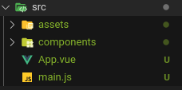

**src/assets/**, aque encontraemos los activos del proyecto, es interesante señalar que es estos archivos será incroporados por las herramientas de desarrollo en el bundle final.

**src/components/** en este directorio se ubican los archivos de componentes de vue con la extension .vue

**src/App.vue** es otro componente de Vue, y básicamente es el "primer componente"

### Primer componente
 Pongamos atención al archivo App.vue
~~~
<template>
  

    
    <HelloWorld msg="Hola Philip !!!"/>
  

</template>
~~~
el HelloWord es una etiqueta personalizada.
Este es un componente que tambien es importado desde
~~~
import HelloWorld from './components/HelloWorld.vue'
Otra forma es importar es utilizar el @
import HelloWorld from '@/components/HelloWorld.vue'
~~~
El **@** es el punto de entrada de la carpeta **scr**.

con esto importamos el componente, pero además tiene que ser explicitamente declarado a Vue que es el componente que va a ser utilizado en el primer componente.

esto de hace en 
~~~
export default {
  name: 'App',
  components: {
    HelloWorld
  }
}
~~~

en resumen
este componente 
~~~
<template>
  

    
    <HelloWorld msg="Hola Philip !!!"/>
  

</template>
~~~
tiene incorporado el componente HelloWord **importado** desde **'@/components/HelloWorld.vue'** y declarado en los componentes de la aplicación.

Los Nombres de los componetes se pueden declara
*NombreDelComponente*
ò
*nombre-del-componente*
Ademas se puede poner las estiquets como

~~~
<componente />
o
<componente></componente>
~~~

Para nuestro primer componente crearemos el archivo **Counter.vue** dentro del directorio de componentes.
Donde podremos definir la tres secciones:
Template
Script
y los estilos (saas)

con las extenciones que tenmos lo podemos crear facilmente tecleando vue y selecionamos la opcion de crear componente.

### Estado de un componente

~~~
export default {
    name:'Counter',
    data(){
        return{
            counter:5
        }
    }
}
~~~
incorporaremos la parte de la data, la cual es un objeto reactivo, lo que significa que Vue va a estar pendiente de cualquier cambio que se produzca en ella.

y lo incorporamos al template
~~~

 {{counter}} 

~~~

Los componentes no deberia hacer operaciones mas complejas, solo se debe utilizar para representar información.

### Propiedades Computadas
Supomgamos el siguiente código en el la seccion del template de nuestro componente Counter

~~~
<template>
  

    <h2>Counter!!</h2>
    
{{ counter }} 2 {{ Math.pow(counter, 2) }}

    
{{ counter }} 2 {{ Math.pow(counter, 3) }}

    
{{ counter }} 2 {{ Math.pow(counter, 4) }}

    
{{ counter }} 2 {{ Math.pow(counter, 5) }}

    
{{ counter }} 2 {{ Math.pow(counter, 6) }}

  

</template>
~~~
Cada vez que la linea se ejecta, se vuelve a realizar la misma operación. Pero imaginemos que sea el resultado de una llamada a una api o algo mas pesado que este simple calculo.

Incorporamos un método
~~~
export default {
  name: "Counter",
  data() {
    return {
      counter: 5,
    };
  },
  methods:{
      getSquareValue(){
          return 'Hola '
      }
  }
};
~~~

y luego lo llamamos desde la sección de template.

Esto puede servir, pero se volvera a ejecutar cada cada vez que sea llamado, osea linea por linea.

Pero esto no es lo recomendado, por que nuevamente esto podría ser un calculo exhaustivo.

Seria conveniente mantener en cache el resultado de esta función hasta que el valor de algun argumento cambie.

[Enlace a Documentación de propiedades computadas](https://v3.vuejs.org/guide/computed.html#computed-properties)

Una mejor forma sería utilizar un valor computado, que funciona al mismo nivel que data y methods. Dònde podré crear propiedades computadas, las cuales tienen la ventaja sobre lo metodos que éstas se guardan en el cache lo que ayuda a que sea más eficiente el proceso.

~~~
computed:{
      squareCounter(){
          console.log('computed squareCounter')
          return this.counter*this.counter
      }
  }
~~~
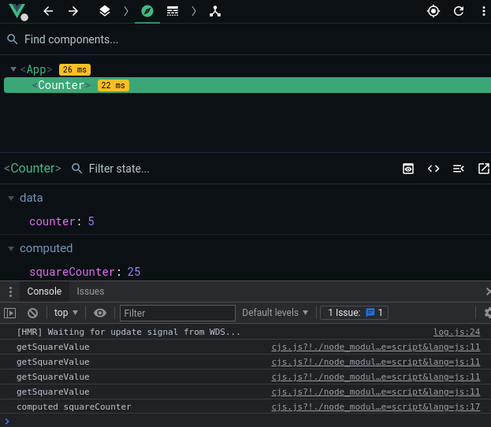

como observamos solo hay una llamada en de la propiedad computada y 4 del método.

Si actualizamos el template y ponemos la propiedad computada, en todas las líneas dónde teníamos el método
~~~

{{ counter }} 2 {{ squareCounter }}

~~~
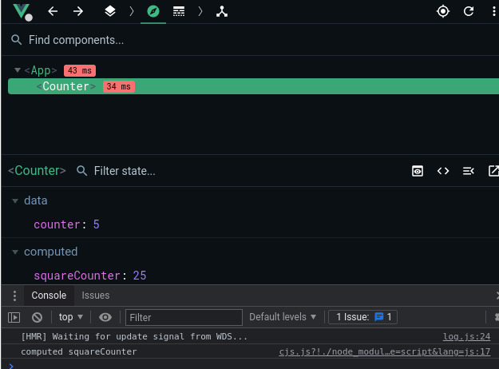

Así tenemos que el calculo se realiza una sola vez.

Es importante señalar que Vue estará "pendiente" de los cambios en la variables **counter** y si se produce un cambio en ella, la propiedad computada se volvera a calcular.

### Incrementar y Decremento
---

En esta seccion se debe poner dos botones uno para incrementar el valor de counter y otro para reducir su valor ambos en 1.

La solucion es
~~~
<template>
  

    <h2>Counter!!</h2>
    
{{ counter }} 2 {{ counter * counter }}

    

        <button v-on:click="sumaUno">+1</button>
        <button @click="restaUno">-1</button>
        

  

</template>

~~~

### Propertis Props
---

Vamos a al archivo App.vue y dupliquemos el componente counter.

~~~

    
    <Counter />
    <Counter />

~~~

Como resultado ambos componetes estaran en la página web y cada uno funcionará en forma independiente.

Sin embargo, es necesario poder diferenciarlos en el front en.
Para ello es necesario la incorporación de atributos o propiedades en estos compenetes.

En la llamada al componente, le podemos pasar atributos de la siguiente forma:
~~~
<Counter titulo-de-la-seccion="Entraron" />
~~~
 y a su a vez incorporar el atributo props ya dentro del componente y sobre la data
 ~~~
 export default {
  name: "Counter",
  props:{
      
  },
  data() {
  etc ....
~~~
Las *props* se pueden definir de varias maneras:

1 Como un array

~~~
  props:['titulo-de-la-seccion']
~~~
y la incoporamos en la seccion que nos interesa del componente
~~~
  <h2> { { tituloDeLaSeccion } } </h2>
~~~

### Diferentes formas de definir las props
Las properties (props) estan previamente definidas en las propiedad del objeto
~~~
props:{
    tituloDeLaSeccion:String,
    start:{
      type:Number,
      default: 100,
      required: true,
      
    }
  },
~~~

### Validacion de las Props
Vamos a asumir que nuestro valor de la propiedad start tiene que ser mayor que 100

El validador recibe como paramtro el valor que vamos a validar y retornará un valor true si pasó la validación o un false si no la pasó
~~~
validator(value){
        return value>=100
      }
~~~
la docuemntacion de las propiedades es
[Enalce a la Docuemntacion de las Properties](https://v3.vuejs.org/guide/component-props.html#prop-validation)

### Watch Observar cambios en una propiedad reactiva

capturar el valor de la caja de texto.
Creamos un valor reactivo el "question", el cual lo enlazamos por medio de v-model al input box que recibirá lo que escribe el usuario.
Adicionalmente incorporamos un watch, que nos permite estar observando los cambios sobre el valor de la variable.

~~~
  

      <input @type="text" name="" id="" placeholder="Hazme una pregunta"
        v-model="question"
        
      >
      
 Recuerda terminar con un signo de interrogación (?)

      

          <h2>{{ question }}</h2>
          <h1>Si, No , Dejame ver</h1>
      

    

</template>

~~~

### Seccion 6 Pruebas Unitarias
Sección de pruebas unitarias, el objetivo es probar todo el trabajo realizado
- Jest
- Expect
- Spies (SpyOn)
- Ciclo de Vida de las pruebas
- wrapper
- ShallowMount
- Mount
- Expect
- Snapshot
- Props
- Mocks

### Pruebas unitarias de integracion
las pruebas no son una pérdida de tiempo ya que nos permiten contar con un código de calidad.

Pruebas unitarias estan enfocadas en pequeñas funcionalidades de la aplicación, son pruebas "atomicas", en funciones especificas como un elemento independiente.

Las pruebas de integración enfocadas en como reaccionan varias piezas en conjunto
(toman un conjunto de componentes y su funcionamiento)

Caracterisiticas de las pruebas:
1. Fáciles de escribir
2. Fáciles de leer
3. Confiables
4. Rápidas
5. Principalmente Unitarias

Se debe ir de los especifico a lo general
Los tres puntos para realizar cualquier prueba son AAA:
- Arrange (Arrglar)
- Act (Actuar
- Assert (Afirmar)

El Arrenge es cuando se prepara el sujeto de prueba (la funcion) aqui, Inicializamos las variables, realizamos las importaciones, es decer, se prepara el ambiente para hacer la pruebas.

Act, aquí es dónde realizamos acciones sobre el sujeto, por ejemplo, llamar métodos, simular clicks, realizar acciones sobre el paso anterior, en general simular lo que queremos probar.

En el terecer paso, Assert, lo que hacemos es observar el comportamiento resultante, verificar si los resultados son los esperados, por ejemplo que algo cambie, que algo se incremente o bien que no suceda nada.

Mitos
- hace que la aplicacion no tenga errores (Puede exister errores)
- Las pruebas no pueden fallar (pueden fallar)
- Hecen mas lenta la aplicación (no es asi, las pruebas se ejecutan en el entorno de desarrollo)
- Es una pérdida de tiempo, puede llegar a ser cierto ya que realizar las pruebas pueden llegar a demorar el mismo tiempo que en desarrollarla.
- Hay que probar todo ( si hasta dónde se pueda si, se prueba las ruta critica)

NO OLVIDAR QUE LAS PRUEBAS SON PARA ASEGURARSE QUE LA APLICACIÓN FUNCIONE COMO SE ESPERA

### Primera Prueba en VUE

En la carpeta test/unit, se creará la misma estructura de directorios que se tiene en src.

Asi por ejemplo si quisieramos probar Counter.vue, que se encunetra en el directorio "components", en el directorio test/unit, deberiamos crear el directorio "components". Se tiene que contar con la misma estructura de directorios, lo que hará más facil encontrar la prueba asociada a cada componente o funcionalidad que se desea probar.

Las pruebas se defienen en test suites, los cuales comeinzan con el **describe**, luego se le incorporan todo los test que queramos realizar
~~~
describe( 'Example Component',()=>{
  test('Debe de ser mayor a 10',()=>{
    // Arreglar
    let value = 5;
    // Estimulo Act
    value = value +2
    // Observar el resultahdo
    if(value>10){
      //TODO todo bien
    } else {
      throw `${ value } no es mayor a 10`
    }
  } )
})
~~~

### Expect
jest [Documentacion Jest](https://jestjs.io)
con jest no son necesarias las aserciones con el if else y trhow tal como lo pusimos.

Expect nos permite realizar una serie de evaluaciones y manejar los resultados

los test suits se estructuran de la siguientye manera
~~~
describe('Nombre del componente',()=>{
  test('Descripción de prueba a realizar',()=>{
    Cuerpo de la preuba
    excpect()=> que nos permititá evaluar el resultado esperado

  })
})
~~~
La prueba de snapchot, nos permite comprar el codigo con un "foto" almacenada

~~~
import { shallowMount, mount } from '@vue/test-utils'
import Counter from '@/components/Counter'

describe('Counter Component', ()=>{
    // Esta prueba nos permite saber si el código se encuentra tal como lo dejamos
    test('Debe ser identico al Snapshot',()=>{
        const wrapper = shallowMount( Counter)
        
        expect( wrapper.html() ).toMatchSnapshot()

    })
})
~~~

Para actualización de snapshot
~~~
npm run test:unit -- -u
~~~

### Verificar valor de una etiqueta HTML
~~~
test('H2 pero verificando que exista',()=>{
        const wrapper =shallowMount(Counter)
        expect(wrapper.find('h2').exists()).toBeTruthy()
        const h2Value=wrapper.find('h2').text()
        expect(h2Value).toBe('Counter')
    })
~~~
prueba de un atributo html
~~~
test('El valor por defecto debe ser 100 en el parrafo',()=>{
        const wrapper = shallowMount(Counter)
        const parrafos = wrapper.find('[data-test-id="counter"]')
        
        expect(parrafos.text()).toBe('100')
    })
~~~

### Simular Eventos

Evaluaremos que sucede si se hace click en un boton
~~~
test('Incremento en 1 al presionar el boton',async()=>{
        const wrapper = shallowMount(Counter)
        const value = wrapper.find('[data-test-id="counter"]').text()
        console.log('Valor original de value >>>>: '+value)
        const btnInc = wrapper.find('button')
        await btnInc.trigger('click')     //=> dispara el evento click y el await es para esperar la re-rendirzasción del DOM virtual
        const value2 = wrapper.find('[data-test-id="counter"]').text()
        console.log('Nuevo Valor de value >>>>: '+value2)
        expect(value2).toBe((parseInt(value)+1).toString())
    })
~~~

### Leer los props en las pruebas
~~~
test('Debe establecer el valor por defecto',()=>{
  const {start} = wrapper.props()
  let value = wrapper.find('data-test-id="counter"]').text()
  expect(Number(value)).toBe(start)
})
~~~

### Enviar Props y Evaluarlas

Las propos se envian al momento de montar el componente para las pruebas

~~~
const wrapper=shallowMount(Counter,{
            props:{
                tituloDeLaSeccion:nomTituloPrueba,
                start:5
            }
        })
~~~

### Pruebas iniciales Indisecion Component
~~~
import { shallowMount, mount } from '@vue/test-utils'
 import Indesicion from '@/components/Indecision'
 describe('Test Indesicion',()=>{
     let wrapper;
     beforeEach(()=>{
         wrapper=shallowMount(Indesicion)
     })
     test('Prueba de snapshot del componente',()=>{
         expect(wrapper.html()).toMatchSnapshot()
     })
 })
 ~~~
### pruebas a realizar
~~~
test('Describir en el Input no debe disparar nada (console.log)',()=>{

})
test('Al escribir el ? disparar fetch',()=>{

})
test('Pruebas en getAnswer',()=>{

})
test('Pruebas en getAnswer -Fallo en Api',()=>{

})
~~~

### Spy y Mocks

Una consideracion es hacer llamados a la API algunas tienen costos y habrá que utilizar mocks

~~~
 consoleLogSpy=jest.spyOn( console ,'log')
~~~
El spy nos permite ver si una instruccion es llamada, en este caso vemos si console.log es llamado en la funcion
~~~
test('Describir en el Input no debe disparar nada (console.log)',async()=>{
        const input=wrapper.find('input')
        await input.setValue('Hola Mundo')
        /* expect(consoleLogSpy).toHaveBeenCalled() */
        expect(consoleLogSpy).toHaveBeenCalledTimes(2)
     })
~~~

### Spy con la instancia de Vue
aun no hemos comprbado que el getAnswer no ha siso disparado
creamos:
~~~
const getAnswerSpy= jest.spyOn(wrapper.vm,'getAnswer')
~~~
y verificamos que no haya sido llamado
~~~
expect(getAnswerSpy).toHaveBeenCalledTimes(0)
~~~
para detalles del wrapper revisar [este enlace](https://vue-test-utils.vuejs.org/api/wrapper/#emitted)

### probar que el getAnswer fue llamado

### pruebas sobre fetch api

### simular un fallo en el API
