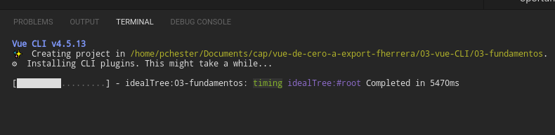
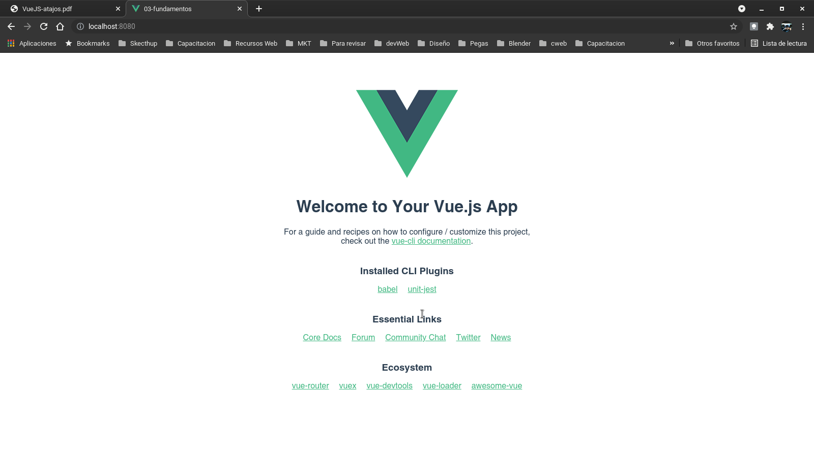

## Temas de la Seccion

Primeros pasos con el Vue CLI
En el cual Vue apoya con una serie de pasos para la creación de una aplicacion.

Trabajaremos con el paso de informació a traves de proprties

Revisaremos en el uso Vue DevTools en Chrome, las cuales nos da el control absoluto de la aplicacion y nos permite hacer una serie de pruebas y modificaciones.

### Temas Puntuales
1. Estructura de directorios.
2. Atajos en Vue
3. Props
4. Methods
5. Propiedades computadas
6. Componentes
7. Validaciones
8. y Mas

### Primera aplicacion con Vue CLI

Desde la terminal verificamos la version de vue
~~~
vue --version
~~~
Crearemos la primera aplicacion con vue, para ello, en la terminal y dentro de la carpeta del proyecto utilizaremos el comnado.

*vue create nombreDelPRoyectoSinEspacios*

En nuestro caso.
~~~
vue cretae 03-fundamentos
~~~

Pregunta que version queremos utilizar. En nuestro casa selecionaremos la opcion manual.

Babel, no permite mantener el codigo Javascript compatible, por ello o vamos a selecionar.
Linter es una potente herramienta para la validacion del de codigo, pero en este momento no lo utlizaremos ya que puede generarnos algunos inconvenientes.

Es importante señalar que si inicialmente no se selecciona algo como por ejemplo Router, no es problema incorporarlo posteriormente.

Para efectos del ejemplo selecionaremos:
Choose Vue Version
Bable
Unit Testing

Por último, nos preguntará si deseamos generar un preset, respondemos que NO en esta oportundad por que nos faltan varias cosas como Router, etc

y se ejecuta la instalacion.

Nota importante: es recomendable que en un proyecto solo utilizar npm o yarn

Al finalizar la instalación nos muestra lo siguiente:

Notemos que se ha creado el directorio de nuestra aplicación con todas sus dependencias, en estes caso *03-fundamentos*. 

Y no propone dos comandos a ejecutar, el cd para ir a la carpeta y npm run serve. Al ejecutar este último, despliega el servidor de desarrollo

Donde podremos ver en nuestro navegador la aplicacion desplegada.

### Estructura de Directorios Generada por defecto

la carpeta de **node_modules** es de solo lectura y tiene los archivos y directorios ya que son solo para que funcionen algunas cosas y no serán parte parte de  del bundel o paquete final.

**public** es el directorio publico y sirve de "cascaron" dónde se montará la aplicacion final.
En el archivo index html se encunetra la directiva 
~~~
<noscript>
      <strong>We're sorry but <%= htmlWebpackPlugin.options.title %> doesn't work properly without JavaScript enabled. Please enable it to continue.</strong>
</noscript>
~~~
Que le avisa al usuario que debe tener activado javascript, ya que si no lo tiene activado la aplicacion no va a funcionar.
La aplicacion se monatar en la siguiente directiva
~~~

~~~
**test/**, sirve para agrupar las pruebas

Los archivos con la extension .spec.js, son archivos dedicados para hacer evaluaciones sobre componentes o piezas de la aplicacion.
No necesariamente son compnentos o funciones de VUE, sino que tambien pueden ser nuestros compenetes, clases o funciones.

**.browserslistrc**, son archivos de configuracion, que en general no lo utilizaremos.

**babel.config** archivo de configuracion de Babel.

**jest.config** archivo de configuración de jest

**package.json** tenemos los paquetes tanto de produccion como los paquetes de desarrollo, estos últimos no llegan a la version de producción. 
Las dependencias, llegaran a producción, pero de una forma optimizada.
Los scripts son los "comandos" que seran ejecutados

A diferencia de una aplicación de node, los modulos de node en general son para apoyar el desarrollo.

### Estructura básica del directorio src

**src/**

**src/assets/**, aque encontraemos los activos del proyecto, es interesante señalar que es estos archivos será incroporados por las herramientas de desarrollo en el bundle final.

**src/components/** en este directorio se ubican los archivos de componentes de vue con la extension .vue

**src/App.vue** es otro componente de Vue, y básicamente es el "primer componente"

### Primer componente
 Pongamos atención al archivo App.vue
~~~
<template>
  

    
    <HelloWorld msg="Hola Philip !!!"/>
  

</template>
~~~
el HelloWord es una etiqueta personalizada.
Este es un componente que tambien es importado desde
~~~
import HelloWorld from './components/HelloWorld.vue'
Otra forma es importar es utilizar el @
import HelloWorld from '@/components/HelloWorld.vue'
~~~
El **@** es el punto de entrada de la carpeta **scr**.

con esto importamos el componente, pero además tiene que ser explicitamente declarado a Vue que es el componente que va a ser utilizado en el primer componente.

esto de hace en 
~~~
export default {
  name: 'App',
  components: {
    HelloWorld
  }
}
~~~

en resumen
este componente 
~~~
<template>
  

    
    <HelloWorld msg="Hola Philip !!!"/>
  

</template>
~~~
tiene incorporado el componente HelloWord **importado** desde **'@/components/HelloWorld.vue'** y declarado en los componentes de la aplicación.

Los Nombres de los componetes se pueden declara
*NombreDelComponente*
ò
*nombre-del-componente*
Ademas se puede poner las estiquets como

~~~
<componente />
o
<componente></componente>
~~~

Para nuestro primer componente crearemos el archivo **Counter.vue** dentro del directorio de componentes.
Donde podremos definir la tres secciones:
Template
Script
y los estilos (saas)

con las extenciones que tenmos lo podemos crear facilmente tecleando vue y selecionamos la opcion de crear componente.
