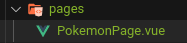
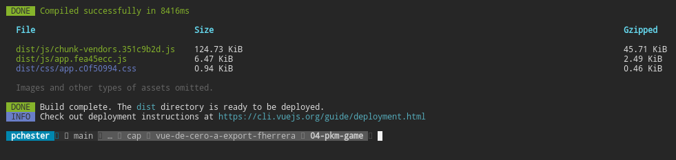

# Seccion 7

## Para crear un nuevo proyecto vue

~~~
vue create 04-pkm-game
~~~
dónde 04-pkm-game es el nombre de la aplicacion y consecuentemente su directorio

Para importar estilos css y que queden en forma global, se deben importar en el archivo **main.js**

~~~
import '../src/css/styles.css'
import '../src/css/animations.css'
~~~

Nota Importante.
Para proyectos más grandes se recomienda la siguiente estructura de directorios
~~~
src/
+--modules/
|  +-- moduleA/
|      +-- components/
|      +-- services/
|      +-- helpers/
|      +-- router/
|      +-- store/
|  +-- moduleB/
|  +-- moduleC/
~~~
De esta forma cada modulo quedará aislado

## Componentes Necesarios Para la aplicación
dentro de src/ crearemos la carpeta pages, y dentro de ella crearemos el componente PokemonPage.vue.

Luego en el editor de texto utilizamo vue-> para crear la estructura dle componente.

### emit emitir
$emit permite emitir datos del componente hijo al componente padre

$emit(nombreDelEvento)

### Paso a Productivo

El script "build" genera la version de producción sacanbdo todo lo que no es necesario para ella

desde la termina:
~~~
npm run build
~~~

se crea la parpeta dist, donde se ponen los archivos necesarios para correr en productivo.

# Seccion 8
Temas de la seccion
1. Pruebas con axios
2. Pruebas de Data aleatoria
3. PRuebas con emisiones
4. Multiples emisores al mismo tiempo
5. stubs
6. Revisión de cambio en propiedades reactivas

## Pruebas con axios
axios.spec.js

## Pruebas en helpers
Para iniciar las pruebas es siempre recomendable comenzar con los elementos mas sencillos y de a poco a lo mas complejo
revisar archivo **getpokemonoptions.spec.js**

## Pruebas de Pokemon Picture

