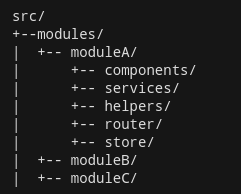
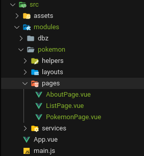

# Seccion 9

La forma mas ordenada de desarrollar una plicacion es separandola dentro de módulos y dentro de ellos, todas las carpetas necesarias que que dicho modulo funcione correctamente. Estos modulos pueden ser:
productos,
pago
carro de compras, etc.

en nuestro caso

configuraremos router en forma manual
## Configuracion Manual de Vue Router

[Enlace a la Documentacion de Vue Router](https://next.router.vuejs.org/)

Es importante no mezclar npm con yarn **OJO**.

~~~
npm install vue-router@4
~~~
Con esto se cargo una dependencia que solo es de desarrollo:

La configuración del router es
1. Definir los componentes de las rutas
2. Definir las rutas
3. Crear de la instamcia del router
4. Indicar la implementación del historial (Hash-Memory-Etc)
5. Crear y montarla en la aplicación
    Esta instancia se crea y monta Antes del mount de la App

En general para la configuracion se utiliza el directorio src/routes

~~~
import { createRouter, createWebHashHistory } from 'vue-router'
import AboutPage from '../modules/pokemon/pages/AboutPage'
import ListPage from '../modules/pokemon/pages/ListPage'
import PokemonPage from '../modules/pokemon/pages/PokemonPage'
// 1 Definición de las rutas y Definicion de las rutas
const routes = [
    { path: '/', component: ListPage },
    { path: '/about', component: AboutPage },
    { path: '/id', component: PokemonPage }
]
// 3 crear la instancia del router
const router = createRouter({
    history: createWebHashHistory(),
    routes,
})
export default router
~~~

Luego en el archivo main.js montaremos el router creado

~~~
createApp(App)
    .use(router)    
    .mount('#app')
~~~
Para que nuestro router este funcional, en el componente App.vue, dentro del template tenemos que llamar al router-view
~~~
<template>
  
  <router-view/>
</template>
~~~

## No page found

Incorporamos en la rutas lo que sucede si no hay cohincidencia de la página ruta, es decir un error 404.
~~~
 { path: '/:parhMatch(.*)*', component: NoPageFound },
~~~
:parhMatch(.*)* se utiliza si ningún de path a sido encontrado

## LazyLoad de Páginas

EL objetivo es que bundle de la aplicación se más pequeño y se importen en la medida que se necesiten

La carga perezosa lo que hace es llamar las rutas en la medida que se requiere, para implementarle se tienen que modificar las definiciones de las rutas incorporando una función flecha que llame su importación

~~~
component: ()=>import(/* webpackChunkName: "ListPage" */'../modules/pokemon/pages/ListPage')
~~~

La seccion comentada es para que webpack ponga el nombre del "mudulo" a cargar para poder analizarlo en las devtools de chrome

## Navegar entre páginas RouterLink
Para navegar entre páginas se tiene que utiliza el router link en logar de un anchor.
~~~
<router-link to="/">Pokemon List</router-link>
<router-link to="/id">Pokemon Por ID</router-link>
<router-link to="/about">About</router-link>
~~~

## Lifecycle Hooks - Ciclo de vida de un componente

No son mas  que un método (o función) que se ejecuta en cierto momento del tiempo, en este caso son los métodos que se van a dispara en cierto momento del ciclo de vida del componente

