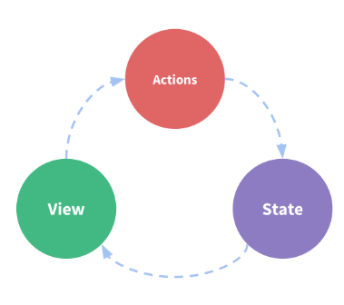
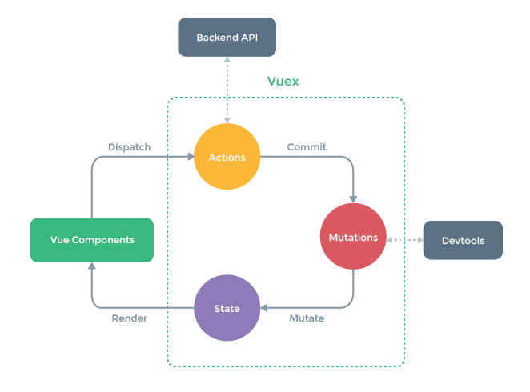
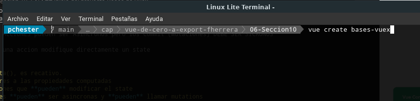
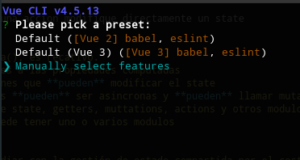
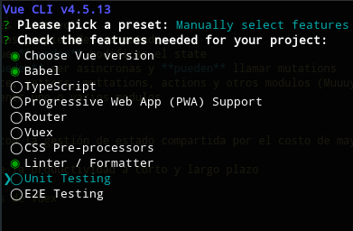

# Sección 10
Haste el momento nuestras aplicación solo le ha enviado información a los compoenentes hijos a traves de las props y atributos o bien desde los hijos al padre por eventos.

(Dif entre props y attrs, las props se colocan en la definición del componenete,y los attr son opcionales)

Vuex nos permitira gestionar el estado global de la app.

Vuex es un gestor de estado muy popular en Vue ya que funciona como vue.

Acciones son por naturaleza asincronas, nos permiten hacer peticiones http o tareas que son asincronas

Mutaciones son sincronas y por lo general modificcan el state

State, es un objeto reactivo (al igual que la data)

Getters, forma pre procesada para obetener información del state.

La recomendación es Siempre tarbajar con Modulos de modo de aslar las presentaciones.

## temas puntales de la sección
- Que es Vuex?
- Qué problemas resuelve Vuex?
- Actions
- Getters
- Mutations
- State
- Módulos
- Segmerntacón
- VuexDevTools
  
## Introducción a Vuex

La idea de Vuex es contar con un Store dónde se almacena y obtiene la información paara y de los componentes.

Este Store es un elemento reactivo (al igual que data)

en un escenario mas completo lo podemos ver esta de forma

Es importante que las ACCIONES pueden ser Asincronos pero los Commit (Mutaciones) DEBE SER SICRONOS

No se pueda hacer que una accion modifique directamente un state

Conceptos Generales
- State: similar a data(), es recativo.
- Getters: son similares a las propiedades computadas
- Mutation: son funciones que **pueden** modificar el state
- Actions, las acciones **pueden** ser asincronas y **pueden** llamar mutations
- Modules, agrupador de state, getters, muttations, actions y otros modulos (Muuuy utiles)
- Store ers unico y puede tener uno o varios modulos

Cuando ocupar Vuex
-  Vuex nos ayuda a lidiar con la gestión de estado compartida por el costo de mayor estructura de archivos.

-  Es una compensación entre la productividad a corto y largo plazo

## Inicio del proyecto Bases de Vuex

Crearemos en proyecto

~~~
vue create bases-vuex
~~~

Para comenzar no va mos a seleccionar la opcion de vuex desde la pantalla de inicion para aprender a instarla y configurarlo desde el comienzo.

El objetivo en esta sección es aprender a configurarlo, luego a modularizarlos y luego optimizarlo.

## Instalación Manual de Vuex